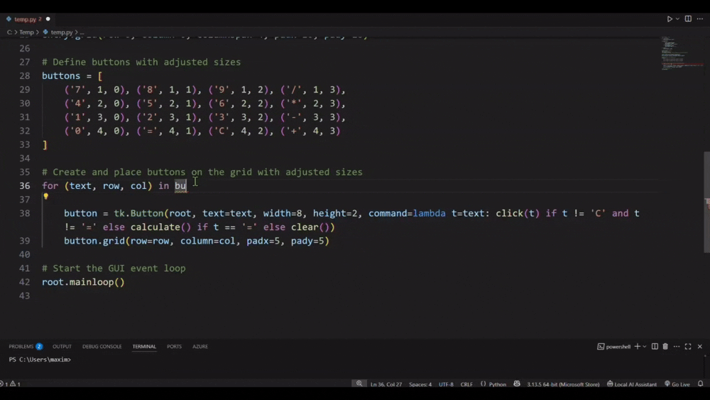

# Local AI Assistant

A Visual Studio Code extension that connects to a local LLM (Large Language Model) API endpoint and provides code completion, validation, and query-via-chat functionality. Perfect for developers using private or offline models running on their workstation or on the local network.

## Requirements

- A running local LLM API endpoint such as [LM Studio](https://lmstudio.ai/), [Ollama](https://ollama.com/), [KoboldCpp](https://github.com/LostRuins/koboldcpp), or [Oobabooga](https://github.com/oobabooga/text-generation-webui/releases)
- Network access to said endpoint (localhost or LAN)
- VS Code version `1.90.0` or newer

## Connecting the extension to your LLM
The extension must be connected to your LLM before you can use it. Follow the steps below to connect it.

1. Install an LLM service provider such as [LM Studio](https://lmstudio.ai/) if you haven't already
2. Start the servce and host your model on the network
3. Install the extension in your VS Code
4. Open the extension chat panel and navigate to the extension settings
5. Update the endpoint URL to your LLM service URL
6. Update the api Type (OpenAPI-compatible vs Ollama)
7. (Optional) Add an API key or specify a model if your service requires them

## Features List
- Code validation / Code completion in chat
- Code completion (in-line) - Coming soon
- Tooltip / Right-click menu with extension commands
- File context (multiple files coming soon) / Language auto-detection
- Chat / Extension Settings UI

## Validate Code Block  
Checks and validates selected code (or entire file if nothing is selected).

- Windows: `Ctrl + Shift + Alt + V`  
- macOS: `Cmd + Shift + Alt + V`

## Auto-Complete Code in Chat
Autocompletes the current line or selection in chat using your configured LLM.

- Windows: `Ctrl + Shift + Alt + Enter`  
- macOS: `Cmd + Shift + Alt + Enter`  

## Auto-Complete Code In-line
- `Coming soon`

## Open Chat Panel  
Launches an interactive chat interface for general-purpose LLM interaction.

- Windows: `Ctrl + Shift + Alt + C`  
- macOS: `Cmd + Shift + Alt + C`

## Open Settings Panel  
Quickly access and configure settings like endpoint, model, and behavior.

- Trigger via command palette: `Local AI Assistant – Open Settings`

## Editor menu with extension commands
Right-click to quickly access the extension's commands (useful if you want to disable the tooltip)

## Idle Tooltip with extension commands
Shows contextual tooltips when idle, including quick links and actions.

## API Key Support
Store an API key securely for authenticated LLM endpoints.
NOTE: This setting VS Code secure secrets storage API and does **not** store the key in settings.json 

- Windows: `Ctrl + Shift + Alt + K`  
- macOS: `Cmd + Shift + Alt + K`

## Select LLM Model  
Pick a model from your configured service if required (e.g. Qwen, Mistral, etc).

- Windows: `Ctrl + Shift + Alt + M`  
- macOS: `Cmd + Shift + Alt + M`

---

## Extension Settings

Accessible via:
- The gear icon in the chat panel  
- Preferences → Settings → Extensions → Local AI Assistant

## Configuration Options

### API Settings

| Setting                                                  | Description                                                                 |
|----------------------------------------------------------|-----------------------------------------------------------------------------|
| `localAIAssistant.apiLLM.config.apiType`                 | Select LLM type (`OpenAI`, `Ollama`)                                        |
| `localAIAssistant.apiLLM.apiURL.endpoint`                | LLM API base URL (e.g. `http://localhost:1234/v1`)                          |
| `localAIAssistant.apiLLM.config.apiAuthRequired`         | If enabled, prompts user to enter a secure API key                          |
| `localAIAssistant.apiLLM.config.model`                   | Default model for completions and chat (e.g. `qwen2.5-coder-7b-instruct`)   |

### Context Settings

| Setting                                                  | Description                                                                 |
|----------------------------------------------------------|-----------------------------------------------------------------------------|
| `localAIAssistant.context.contextSize`                   | AI model context limit (in tokens)                                          |
| `localAIAssistant.context.includeFileContext`            | Whether to send active editor text during code/chat requests                |

### UI Settings

| Setting                                                  | Description                                                                 |
|----------------------------------------------------------|-----------------------------------------------------------------------------|
| `localAIAssistant.tooltop.enableExtensionTooltip`        | Enables or disables the tooltip in the main code editor                     |
| `localAIAssistant.tooltip.idleTooltipDelay`              | Delay before showing idle tooltips (in milliseconds)                        |

## Upcoming features

- Inline completion
- Status indicator for LLM service
- Token limit/character warnings
- Smart usage/embedding of current file in context
- SSL Validation
---

## Known Issues

- Ollama support is limited
- API Key is optional and usage applies to OpenAI-based back-ends only 
- Temporary freeze possible if endpoint is unreachable during stream
- Auto-scroll can be wonky

---

## Author & Repository

**Author**: [officedrone](https://github.com/officedrone)  
**GitHub**: [github.com/officedrone/local-ai-assistant](https://github.com/officedrone/local-ai-assistant)  
**Issues**: [Report bugs or request features](https://github.com/officedrone/local-ai-assistant/issues)

---

## License

GNU GPL v3

## 3rd party markdown used in chat

[markdown-it.min.js](https://cdn.jsdelivr.net/npm/markdown-it/dist/markdown-it.min.js)
